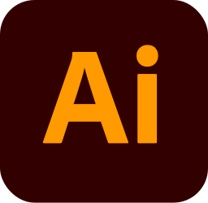

# Hi there, I'm [Canaan-HS](https://github.com/Canaan-HS) :wave:

---

## :trophy: Achievements

## :seedling: Currently Learning...

### Programming Languages 🌐
|  |  |  |  |  |
| :----: | :----: | :----: | :----: | :----: |
|  |  |  |  |  |
|  |  |  |  |  |

### Tools 🛠️
|  |  |  |  |  |
| :----: | :----: | :----: | :----: | :----: |
|  |  |  |  |  |
|  |  |  |  |  |
|  |  |  |  |  |
|  |  |  |  |  |

---

## :bar_chart: Stats
|  |  |
| :----: | :----: |

## :chart_with_upwards_trend: Activity

---

## :bust_in_silhouette: About Me

- **Embedded Systems & Hardware**  
  Explored Raspberry Pi and Arduino from a high school electronics base, plus built and fixed PCs.
- **Reverse Engineering**  
  Curious about software internals, tinkering with binary analysis tools.
- **Web & Desktop Development**  
  Building tools with Python, JS, and PowerShell for web, desktop, and automation (Greasyfork scripts popular).
- **System Diagnostics**  
  Hands-on with hardware/software fixes using various tools and tests.
- **Certifications**  
  Got TQC Java and Python certs early, now focused on real projects.
---
